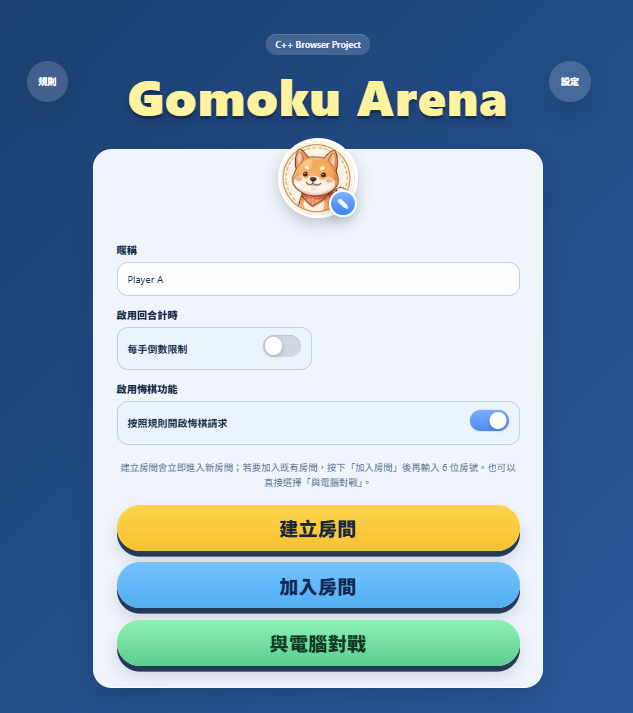
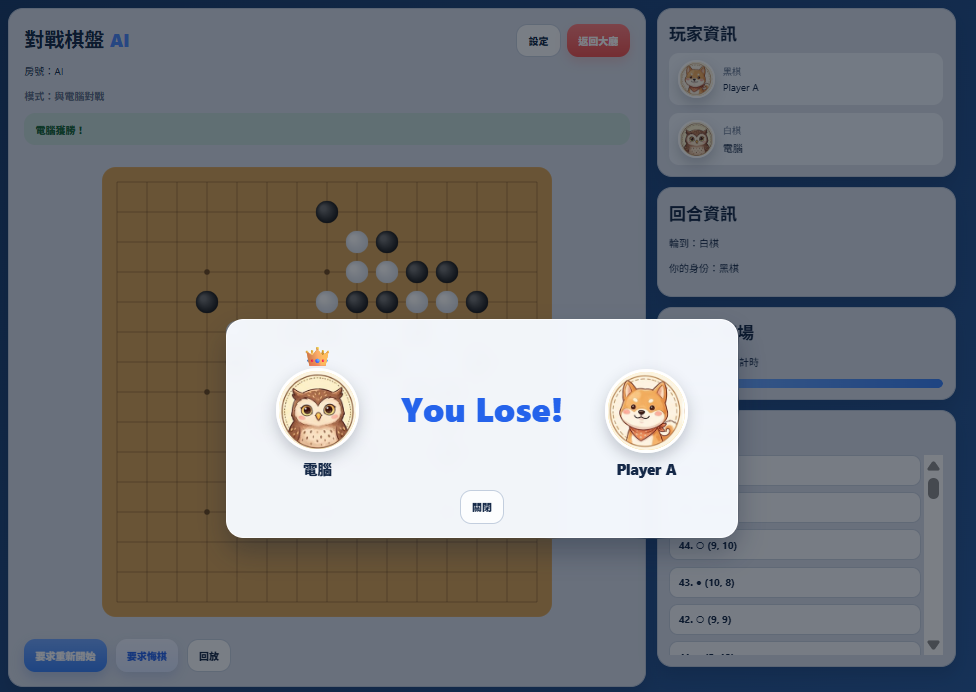

# 🎮 Gomoku Arena V11

A browser-based online Gomoku game powered by a C++ backend server, enhanced with AI gameplay, advanced audio system, and modern UI/UX design.

---

## 🚀 Overview
This project is an advanced version of the Gomoku system.

It keeps the **C++ server architecture** while significantly upgrading:

- 🤖 AI gameplay
- 🎧 Audio system
- 🎨 UI/UX interaction
- 🏆 Visual feedback

The result is a system that feels much closer to a **real online game experience**.

---

## ✨ Features

---

### 🎯 Core Gameplay
- Online 2-player Gomoku
- Black moves first
- Turn-based system with validation
- Five-in-a-row win detection
- Illegal moves are rejected

---

### 🤖 AI Mode (New 🔥)
- Play against computer locally (no server needed)
- Player = Black, AI = White
- AI behavior:
  - Center-first strategy
  - Position evaluation
  - Immediate response after player move
- Supports:
  - Restart
  - Undo
  - Replay

---

### 🌐 Multiplayer System
- Room creation & join via Room ID
- Shareable invite link
- Player identity via private token
- Real-time updates via polling
- Player leave detection with auto room reset

---

### 🎧 Advanced Audio System (Major Upgrade 🔥)

#### 🔊 Sound Types
- 🎵 Background Music (BGM)
- 🔘 UI hover / click sound
- 🪵 Move sound (wood-like piece placement)

#### ⚙️ Features
- BGM / SFX toggle **separated**
- Independent volume control
- Hover sound for:
  - Create room
  - Join room
  - AI mode
  - Avatar interaction
- Move sound redesigned:
  - Short
  - Crisp
  - Wood impact feel

---

### 🧠 Game UX Improvements
- Move history panel (latest move on top)
- Last move highlight
- Hover preview for next move
- Restart voting system (both players must agree)
- Join room via modal popup (cleaner UI)

---

### 🏆 Winning Visualization (New 🔥)
- Automatically detects winning pattern
- Draws **highlight line across 5 pieces**
- Strong visual feedback for:
  - Win
  - Lose
- Enhances game clarity and presentation

---

### 🎨 UI Enhancements (V11)
- Clean presentation-style interface
- Consistent design across lobby and game room
- Card-based layout with modern styling
- Hover button animations + sound feedback
- Centered board layout
- Responsive design

---

### 🧑 Avatar System
- Default avatar: 🐶 Dog
- Click avatar to open selection panel
- 10 selectable animal avatars
- Avatar edit icon on bottom-right

---

### ⏱️ Timer System (Toggleable)
- Enable/disable before creating room
- Custom time per move
- Timeout → automatically skip turn

---

### 🔁 Undo System (Restricted Rules)
Undo is allowed only when:
- You made the **latest move**
- You have already played in the current round
- It is not your opponent’s turn
- The game has not ended

- Requires opponent confirmation
- Disabled after a player wins

---

### 🔄 Replay System
- Replay starts from an **empty board**
- Moves replay in correct order:
  - Black 1 → White 1 → Black 2 → ...
- Each move appears every **1 second**
- Replay is isolated from real-time updates

---

### 🏆 Result System
- Game-over modal popup
- Displays:
  - Winner 👑
  - Loser
  - “You Win / You Lose”
- Clean visual feedback
- Undo disabled after game ends

---

### 🚪 Player Leave Handling
- If one player leaves:
  - Popup notification appears
  - Room resets to waiting state
  - New player can join the same room

---

## 🏗️ Project Structure


# 🎮 Gomoku Arena V11

A browser-based online Gomoku game powered by a C++ backend server, enhanced with AI gameplay, advanced audio system, and modern UI/UX design.

---

## 🚀 Overview
This project is an advanced version of the Gomoku system.

It keeps the **C++ server architecture** while significantly upgrading:

- 🤖 AI gameplay
- 🎧 Audio system
- 🎨 UI/UX interaction
- 🏆 Visual feedback

The result is a system that feels much closer to a **real online game experience**.

---

## ✨ Features

---

### 🎯 Core Gameplay
- Online 2-player Gomoku
- Black moves first
- Turn-based system with validation
- Five-in-a-row win detection
- Illegal moves are rejected

---

### 🤖 AI Mode (New 🔥)
- Play against computer locally (no server needed)
- Player = Black, AI = White
- AI behavior:
  - Center-first strategy
  - Position evaluation
  - Immediate response after player move
- Supports:
  - Restart
  - Undo
  - Replay

---

### 🌐 Multiplayer System
- Room creation & join via Room ID
- Shareable invite link
- Player identity via private token
- Real-time updates via polling
- Player leave detection with auto room reset

---

### 🎧 Advanced Audio System (Major Upgrade 🔥)

#### 🔊 Sound Types
- 🎵 Background Music (BGM)
- 🔘 UI hover / click sound
- 🪵 Move sound (wood-like piece placement)

#### ⚙️ Features
- BGM / SFX toggle **separated**
- Independent volume control
- Hover sound for:
  - Create room
  - Join room
  - AI mode
  - Avatar interaction
- Move sound redesigned:
  - Short
  - Crisp
  - Wood impact feel

---

### 🧠 Game UX Improvements
- Move history panel (latest move on top)
- Last move highlight
- Hover preview for next move
- Restart voting system (both players must agree)
- Join room via modal popup (cleaner UI)

---

### 🏆 Winning Visualization (New 🔥)
- Automatically detects winning pattern
- Draws **highlight line across 5 pieces**
- Strong visual feedback for:
  - Win
  - Lose
- Enhances game clarity and presentation

---

### 🎨 UI Enhancements (V11)
- Clean presentation-style interface
- Consistent design across lobby and game room
- Card-based layout with modern styling
- Hover button animations + sound feedback
- Centered board layout
- Responsive design

---

### 🧑 Avatar System
- Default avatar: 🐶 Dog
- Click avatar to open selection panel
- 10 selectable animal avatars
- Avatar edit icon on bottom-right

---

### ⏱️ Timer System (Toggleable)
- Enable/disable before creating room
- Custom time per move
- Timeout → automatically skip turn

---

### 🔁 Undo System (Restricted Rules)
Undo is allowed only when:
- You made the **latest move**
- You have already played in the current round
- It is not your opponent’s turn
- The game has not ended

- Requires opponent confirmation
- Disabled after a player wins

---

### 🔄 Replay System
- Replay starts from an **empty board**
- Moves replay in correct order:
  - Black 1 → White 1 → Black 2 → ...
- Each move appears every **1 second**
- Replay is isolated from real-time updates

---

### 🏆 Result System
- Game-over modal popup
- Displays:
  - Winner 👑
  - Loser
  - “You Win / You Lose”
- Clean visual feedback
- Undo disabled after game ends

---

### 🚪 Player Leave Handling
- If one player leaves:
  - Popup notification appears
  - Room resets to waiting state
  - New player can join the same room

---

## 🏗️ Project Structure
gomoku-project/
├─ server/ # C++ backend (HTTP server + game logic)
│ ├─ main.cpp
│ ├─ HttpServer.*
│ ├─ RoomManager.*
│ ├─ GameRoom.*
│
└─ web/ # Frontend (HTML / CSS / JS + AI + Audio)
├─ index.html
├─ room.html
├─ style.css
├─ app.js
└─ assets/

## ⚙️ How to Run (Windows + g++)

### 1️⃣ Compile

```bash
g++ main.cpp HttpServer.cpp RoomManager.cpp GameRoom.cpp -o gomoku_server -std=c++17 -lws2_32
```

2️⃣ Run Server
```bash
gomoku_server.exe 8080 ../web
```
3️⃣ Open Browser
```bash
http://localhost:8080
```
